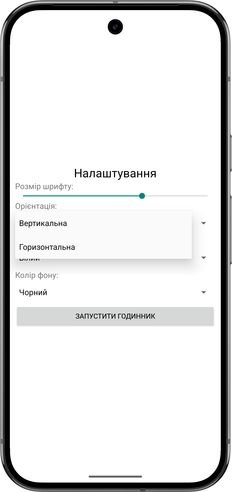
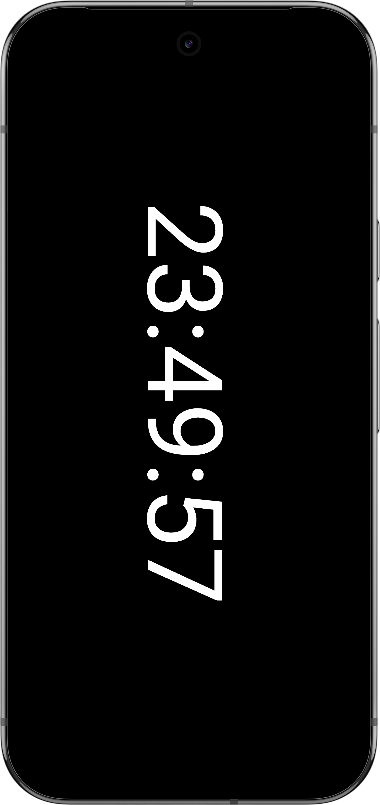
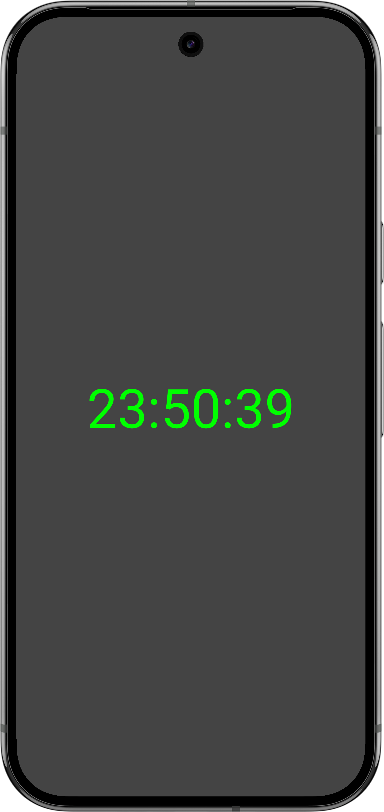

# Android ClockApp

This repository contains the **Android Clock** application, a customizable full-screen clock designed to enhance focus and productivity. The app allows users to tailor the clock's appearance and behavior to suit their preferences.

## Features

- **Full-Screen Clock**: Immersive clock display that hides system UI for maximum focus.
- **Customizable Appearance**:
  - Font size adjustment.
  - Text color selection.
  - Background color customization.
- **Orientation Settings**:
  - Vertical or horizontal display mode.
  - Adaptable layout to make the best use of screen space.
- **Persistent Display**: Keeps the screen on while the clock is active.
- **Simple Navigation**:
  - Easy-to-use settings screen.
  - Seamless switching between clock and settings.

## Screenshots

- **Settings Screen**:
  Customize your clock's appearance and behavior.

- **Full-Screen Clock**:
  Experience an elegant, customizable clock display.

  
  
  

## Requirements

- **Minimum Android Version**: API 24 (Android 7.0 Nougat)

## Installation

1. Download the APK from the [Releases](https://github.com/steminist-ua/ClockApp-Release/releases) page.
2. Install the APK on your Android device.
3. Open the app, adjust your preferences, and enjoy!

## License

This project is licensed under the MIT License. 

## Contact

For questions or feedback, please contact [hello@steminist.com.ua](mailto:hello@steminist.com.ua).

